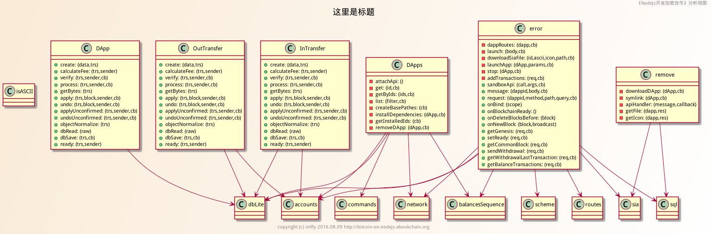

# js2uml
A CLI for converting JS to UML class diagrams.

把js文件转化为Uml类图的命令行工具。[《Nodejs开发加密货币》][] 系列文章里用到的大量js类图，都来自于这个小工具。比如：



## 说明(Description)

[《Nodejs开发加密货币》][] 系列文章里用到了大量的js类图，有的小伙伴很奇怪怎么来的。说实话，前期是我个人一点点手工整理的，当初主要是为了熟悉代码。但是，后来再手工处理的时候，就感觉在浪费生命了。所以，也就有了这个小工具。当然，整理这个小工具的目的，还有一个，那就是顺带介绍 函数式编程的便利，给前面的文章提供一个实例。

本工具，可以帮助您了解下面的技能：

* 抽象语法树（AST）的处理。抽象语法树有很多用途，你可能很少在编码中用到，但是你可能随时都在用，比如：编辑器的自动提示、自动完成等功能，使用Nodejs的小伙伴，最后都要对代码进行混淆、压缩等处理，那些工具也都要用到AST；
* 函数式编程。原来的版本（V0.1.0)，不自觉使用的面向对象的编程方式，也没有使用AST，所以代码挺长，但是功能有限。这个版本，进行了优化，使用函数式编程，大大缩减了代码里，还添加了直接导出.png/.svg/.pu等各种格式的功能;
* 学习plantuml。这是使用代码处理Uml的最好方式，直接使用dot语言（直接生成的.pu文件就是），像编写程序一样画Uml图，真的只有程序猿才能体会的畅快。
* 练习命令行工具开发。

## 安装（Install)

```
$ npm install -g js2uml
```

**注意（Note)**: 如果您想直接导出图片格式，如：png,svg等，需要首先 [Graphviz][]

## 使用（Usage)

**注意（Note)**:输入输出文件是一定要提供的，不然会提示错误。

```
$ js2uml -s ./test/dapps.js -o ./test/dapps.png
```

输出文件后缀格式支持`.png`、`.svg`等[Graphviz][]支持的格式，以及dot格式的`.pu`或`.puml`文件，直接在文件名里提供就是了。

您还可以对生成的图片标题、背景颜色、版本信息等进行定制，详细信息，请查看帮助：

```
$ js2uml --help
```

## 关于(About)

作者微信：kubying

[《Nodejs开发加密货币》][] 是亿书开发文档，相关资源：

源文地址： https://github.com/imfly/bitcoin-on-nodejs

亿书官网： http://ebookchain.org

亿书官方QQ群：185046161（亿书完全开源开放，欢迎各界小伙伴参与）

## 协议（License)

MIT License 2016 @imfly

[《Nodejs开发加密货币》]: https://github.com/imfly/bitcoin-on-nodejs
[Graphviz]: http://www.graphviz.org/
